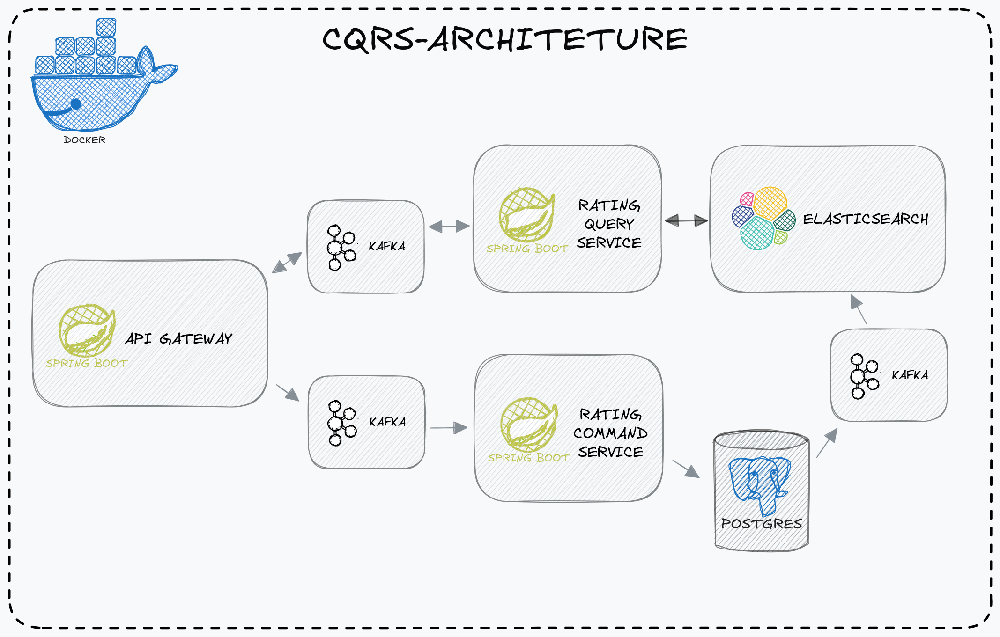

#### Objective

This is a CQRS implementation for a rating service

#### Install

- first you need to clone this repository in your machine, before make sure you have the git
installed, then you run `git clone https://github.com/nothiaki/cqrs-rating.git`;
- go to the project directory using `cd cqrs-rating`;
- before go to the next step make sure you have [docker](https://www.docker.com/) and
[docker compose](https://docs.docker.com/compose/) installed;
- and just run `docker compose up --build` and wait about a minute for the containers get all up
- then run `chmod -X ./up-connectors.sh`

#### DOCS

api-gateway on port 8080 
rating-command-service on port 8090 
rating-query-service on port 8091 
kafka running on port 9092 
postgres running on port 5432 
elasticsearch on port 9200 
kafka connect on port 8083 
